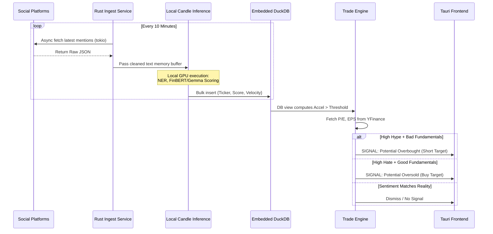

# Eat The Rich - PRD & Implementation Plan (v2)
**Application Type:** Standalone Local-First Desktop App for Day-Traders
**Tech Stack:** Rust (Backend), Tauri (Frontend GUI), DuckDB (Time-Series Data), Candle/Tract (Local LLM Inference).

---

## 1. Market Evaluation & Competitor Analysis
Before building, it is crucial to analyze the existing alternative data landscape. 

**Current Competitors:**
- **ApeWisdom & SwagyStocks:** These platforms scrape Reddit/Twitter to visualize what stocks are trending. *Weakness:* They are just dashboards. They show "GME is highly mentioned" but do not calculate velocity/acceleration algorithms combined with a fundamentals overlay to trigger a strict arbitrage signal.
- **Unusual Whales:** Extremely popular, but focuses almost entirely on Options Flow and Dark Pool data, not NLP-driven retail sentiment.
- **StockGeist / SentimenTrader:** Provide sentiment indexes, but as SaaS platforms. *Weakness:* As a day trader, relying on a SaaS dashboard introduces web latency and abstracts the raw data away from you.

**Our Unfair Advantage (The "Eat The Rich" Edge):**
1. **Local-First & Private:** By running as a standalone Rust binary on the day trader's machine, there is zero network latency between the ingestion API and the database. You spin it up before the opening bell, and shut it down after market close.
2. **Local Inference:** Instead of sending forum payloads to OpenAI (which costs money and introduces latency/rate-limits), we execute small-parameter models (Gemma 4 / Phi-3) *locally* using Rust machine learning frameworks (Candle) leveraging the local GPU.
3. **The Arbitrage Engine:** We aren't just plotting sentiment; we are programmatically searching for the *divergence* between Social Hype and P/E Reality.

---

## 2. Infrastructure & Architecture

Because we are optimizing for a local-first, maximum performance Rust application, the infrastructure design is entirely contained on the host machine.

- **Concurrency Layer:** `tokio` asynchronous runtime will handle non-blocking concurrent requests to the Reddit/Stocktwits APIs.
- **Data Persistence:** **DuckDB**. It is an embedded, extremely fast analytical (OLAP) database optimized for time-series and columnar data. Perfect for storing and aggregating 10-minute sentiment interval ticks without the overhead of running a separate PostgreSQL Docker container.
- **NLP Inference:** HuggingFace's `candle` crate for Rust, allowing us to run ONNX/GGUF models locally on the GPU/CPU for tokenization and sentiment classification.

### Data Flow Diagram

---

## 3. Development Phases & Task List

To ensure an engineering-grade build, we will develop bottom-up: starting with data structures and local ingestion, moving to mathematical inference, and finishing with UI.

### Phase 1: Local Environment & Ingestion Foundation
*Focus: Setting up the Rust project, embedding DuckDB, and pulling live data.*
- [ ] Initialize `cargo new eat-the-rich-core`.
- [ ] Add async dependencies (`tokio`, `reqwest`, `serde`, `dotenvy`).
- [ ] Create API client modules for StockTwits (Ticker stream) and Reddit (subreddit polling).
- [ ] Integrate `duckdb-rs`. Design the schema: `CREATE TABLE sentiment_ticks (ticker VARCHAR, timestamp TIMESTAMP, polarity DOUBLE, topic VARCHAR)`.
- [ ] Build the polling loop that triggers every 10 minutes (configurable via `.env`).

### Phase 2: Local AI & NLP Engine
*Focus: Processing the text on the host machine using Rust ML.*
- [ ] Integrate HuggingFace `candle-core` and `candle-nn`.
- [ ] Download and load a quantized GGUF FinBERT/Phi-3 model into local memory on startup.
- [ ] Write the text pre-processing pipeline (removing URLs, normalizing cashtags).
- [ ] Map the tensor outputs to our `[-1.0, 1.0]` polarity scale.
- [ ] Write the mathematical aggregation views in DuckDB (calculating Velocity and Acceleration over the past 6 intervals).

### Phase 3: The Arbitrage Overlay (Fundamental Mismatch)
*Focus: Fetching the financial reality to contrast against the sentiment.*
- [ ] Write a client to hit Yahoo Finance (via a Rust yfinance port/scraper) or AlphaVantage.
- [ ] Define what "Bad Fundamentals" are programmatically (e.g., Forward P/E > 50, negative EPS, Debt/Equity > 2).
- [ ] Write the `ArbitrageMatcher` struct that takes a high-velocity ticker from Layer 1, fetches the fundamental struct from Layer 2, and evaluates the `alt` logic block from the sequence diagram.

### Phase 4: Standalone Application Shell (Tauri)
*Focus: Giving the day trader a beautiful, low-latency dashboard.*
- [ ] Scaffold a Tauri frontend (`npm create tauri-app`).
- [ ] Bind the Rust core backend functions to the Tauri IPC (Inter-Process Communication).
- [ ] Build a React or SolidJS frontend that listens to the Rust backend and displays live Sentiment Velocity charts and flashing Arbitrage Signal alerts.
- [ ] Compile the final executable binary for local usage.
