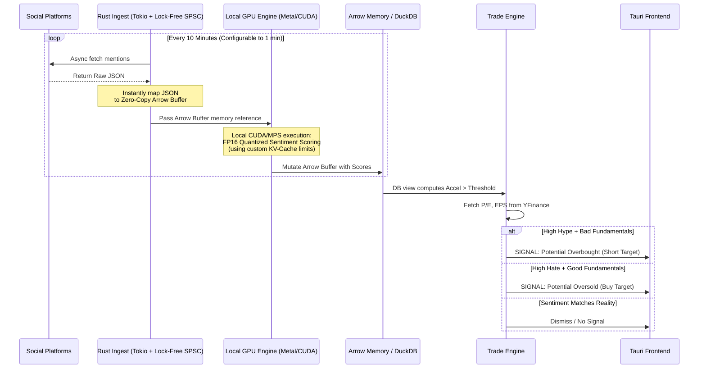

# Eat The Rich - PRD & Implementation Plan (v3 - Ultra-Optimized Final)
**Application Type:** Standalone Local-First Desktop App for Day-Traders
**Tech Stack:** Rust (Backend), Tauri (Frontend GUI), DuckDB + Apache Arrow (Zero-Copy Data), Candle/ONNX (Local LLM Inference with Metal/CUDA acceleration), Custom KV-Cache Compression protocols.

---

## 1. Market Evaluation & Competitor Analysis
Before building, it is crucial to analyze the existing alternative data landscape. 

**Current Competitors:**
- **ApeWisdom & SwagyStocks:** Scrape Reddit/Twitter to visualize what stocks are trending. *Weakness:* They are just delayed cloud dashboards without actionable arbitrage overlays.
- **Unusual Whales:** Focuses on Options Flow and Dark Pool data, not NLP-driven retail sentiment.
- **StockGeist / SentimenTrader:** SaaS platforms predicting indexes. *Weakness:* SaaS abstraction and web latency remove the day trader's crucial edge.

**Our Extreme Unfair Advantages (Eat The Rich v3):**
1. **Zero-Copy Memory Pipeline:** By utilizing **Apache Arrow** internally, the Rust ingest service, DuckDB engine, and Tauri frontend share the exact same memory references. We completely eliminate the nanosecond-crushing overhead of JSON serialization.
2. **True Local Market-Maker Speed:** By leveraging Lock-Free Ring Buffers (SPSC) for thread communication, our internal data routing operates at high-frequency trading (HFT) speeds.
3. **Cross-Platform Hardware-Optimized NLP:** Running Small/Medium LMs (Gemma 4/Phi-3) locally avoids OpenAI API latency. The architecture automatically routes processing through **Apple's Metal (MPS)** on MacBooks, and unleashes **Nvidia CUDA/TensorRT** optimization on Windows rigs (like RTX 4080s), bypassing CPU bottlenecks entirely.
4. **Continuous DPO Learning Loop:** Unlike static sentiment dictionaries, the model automatically upgrades itself weekly using a Direct Preference Optimization (DPO) pipeline that takes successful/unsuccessful predictions (T+1 day stock performance) to continually refine its meme-stock contextual reasoning.

---

## 2. Infrastructure & Architecture

The architecture is entirely contained on the host machine, optimized for minimal memory allocation (pre-allocated buffers) and maximum hardware utilization.

### Data Flow Sequence Diagram

---

## 3. Deep Dive: Extreme High-Frequency Optimizations

To ensure an engineering-grade system, we are implementing hardcore optimizations directly at the inference boundary:

**1. Cross-Platform Local LLM Acceleration (CUDA & Metal)**
- **Intelligent Execution Provisioning:** The rust backend will perform a hardware-check on startup. On Mac, `candle-core` will initialize via the `MetalExecutionProvider` (M-Series optimized). On the Windows rig, it injects the `CUDAExecutionProvider` or `TensorrtExecutionProvider`, taking full advantage of the RTX 4080 matrix cores.
- **Hardware-Tiered Models:** The system will conditionally load 2B-3B parameter models for quick polarity polling, or ramp up to an 8B-9B model for deeper reasoning and sarcasm detection for hardware sporting 16GB+ VRAM (RTX 4080).

**2. KV-Cache Compression Testbed (Experimental)**
- **The Bottleneck:** When streaming thousands of daily Reddit comments into an LLM via sliding-window context, standard Transformers bloat their Key-Value (KV) cache, chewing through VRAM and severely hitting token-generation latency.
- **The Fix:** Because we are building the Rust ML pipeline locally with `Candle`, we have full access to the inference loop. We will explicitly expose the KV-Cache allocation functions to serve as a direct plug-and-play **testbed for your custom KV-Cache compression algorithms**. This allows you to evaluate your compression heuristics (token eviction, tensor pruning) on a brutal, real-time firehose of financial text.

**3. Lock-Free Architecture & Memory Pre-allocation**
- Using Single-Producer Single-Consumer (SPSC) lock-free ring buffers between ingestion and NLP pipelines instead of OS blocking `Mutexes`. Combined with pre-allocated Apache Arrow buffers, this eliminates garbage-collection stalls.

---

## 4. Development Phases & Task List

### Phase 1: Zero-Copy Local Environment & Ingestion
- `[ ]` Initialize barebones Rust project (`cargo new eat-the-rich-core`).
- `[ ]` Set up `tokio` and the Apache `arrow` crate for zero-copy memory layouts.
- `[ ]` Integrated `duckdb-rs` using the `arrow` feature flag. Schema: `CREATE TABLE sentiment_ticks (...)`.
- `[ ]` Build Lock-Free SPSC ring buffers for thread routing.
- `[ ]` Build API clients (Reddit/StockTwits) that instantly map JSON onto pre-allocated Arrow buffers.

### Phase 2: Hardware-Accelerated Local AI & KV-Cache Subsystem
- `[ ]` Integrate `candle-core`. Write the hardware detector to map to either `Metal` or `CUDA` dynamically.
- `[ ]` Load the Tier 1 / Tier 2 Gemma/Phi models dynamically based on detected VRAM, pre-quantized to FP16/INT8.
- `[ ]` **Expose KV-Cache API:** Scaffold the intercept layer within the `candle` inference loop to plug in custom KV-Cache compression algorithms and log memory usage per batch.
- `[ ]` Apply custom Unicode tokenizer fixes (Meme-stock emojis 🚀).

### Phase 3: The Arbitrage Overlay & DPO Loop
- `[ ]` Write DuckDB views for velocity/acceleration indexing.
- `[ ]` Build external fetcher for YFinance fundamentals.
- `[ ]` Code the `ArbitrageMatcher` logic.
- `[ ]` Setup Phase: Write the offline script to collect historical ticker performance and pair it with previous day sentiment alerts to generate Direct Preference Optimization (DPO) datasets for continuous weekly LoRA fine-tuning.

### Phase 4: Extreme Low-Latency Frontend (Tauri)
- `[ ]` Scaffold Tauri / SolidJS for UI.
- `[ ]` Bind Tauri IPC directly to backend Arrow buffers (Zero JSON overhead).
- `[ ]` Implement visual flash alerts for Arbitration Triggers.
