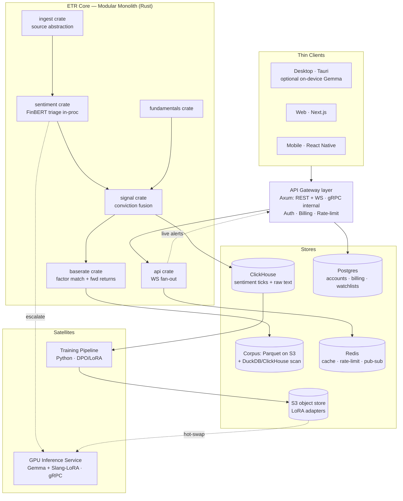
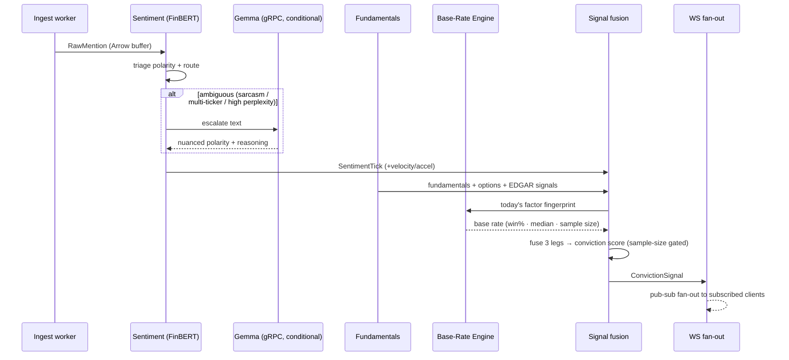
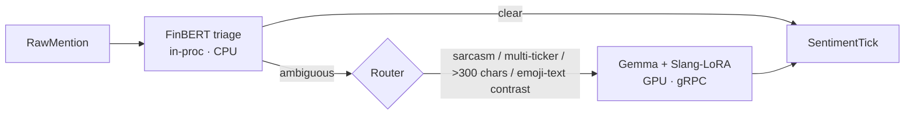
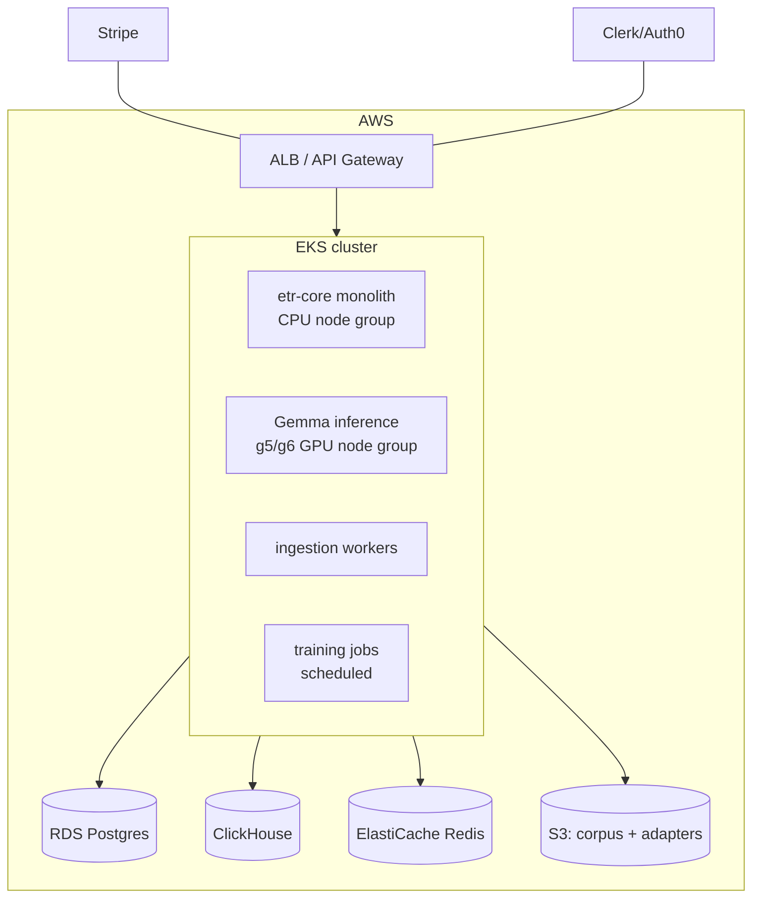

# Technical Design Document — Eat The Rich (SaaS)

**Version:** 1.0
**Status:** Draft for build
**Date:** 2026-06-03
**Companion:** [ETR_SaaS_PRD_v1.md](./ETR_SaaS_PRD_v1.md)
**Supersedes:** local-first architecture in `Context/ETR_PRD_Implementation_Plan_v3.md`, `Context/FinBERTxGemma_PRD_Implementation_Plan_v1.md`

> Technology choices below are **committed recommendations with rationale**. They are defaults to build against, not immutable; each can be overridden before implementation. Where a strong alternative exists, it is named.

---

## 1. Architecture Overview

### 1.1 Decision: Modular Monolith + Satellites (not microservices)

The PRD's logical topology decomposes the system into bounded contexts. That decomposition is **logical, not a deployment prescription.** ETR deploys as a **modular monolith** for the hot path, plus a small number of **satellite processes** that exist only where a genuine hardware or async boundary forces them.

**Why a monolith for the hot path:**
- The signal pipeline is **latency-sensitive and tightly coupled**: ingest → sentiment → fundamentals → base-rate lookup → fusion. Network-splitting these adds serialization + hops to the exact path that demands speed.
- The fusion step needs all three legs **in memory simultaneously**. In-process function calls keep buffers **zero-copy** (Apache Arrow); microservices would force re-serialization across boundaries — the precise overhead the original design eliminated.
- Single team, single language (Rust), early product. Microservices' benefits (independent scaling, polyglot teams, fault isolation) pay off at org scale we don't have; their costs (distributed tracing, partial failure, data consistency, deploy orchestration) are paid immediately.

**The three legitimate satellites** (separate processes at real boundaries):

| Satellite | Why it's separate | Interface |
|-----------|-------------------|-----------|
| **GPU inference (hosted Gemma)** | Different hardware (GPU vs CPU), different scaling curve, batched throughput | gRPC (tonic) |
| **Training pipeline (DPO / LoRA)** | Asynchronous by nature; offline; writes adapters the monolith hot-swaps | Object store (safetensors) |
| **Ingestion workers** | I/O-bound, per-platform rate limits, scale independently of compute | In-process actors *or* queue workers |

**Guardrail:** Enforce module boundaries with **Rust crate separation** (Cargo workspace, crate-per-context). This keeps boundaries microservice-clean so any crate *could* be extracted into a service later — without paying the distributed-systems tax now. This is the "majestic modular monolith" pattern.

### 1.2 System topology



### 1.3 Hot-path dataflow



---

## 2. Cargo Workspace Layout

A single workspace; one crate per bounded context. Boundaries are enforced by crate visibility — crates depend only through typed interfaces in `common`.

```
etr-core/
├── Cargo.toml                # workspace
├── crates/
│   ├── common/               # Arrow schemas, shared types (RawMention, SentimentTick,
│   │                         #   Fundamentals, BaseRate, ConvictionSignal), error types
│   ├── ingest/               # source abstraction trait + per-source adapters
│   ├── sentiment/            # FinBERT triage (Candle, in-proc) + router + gRPC client to Gemma
│   ├── fundamentals/         # yfinance/FMP/options/EDGAR clients
│   ├── baserate/             # factor compute, fingerprint, fwd-return lookup, factor-match scan
│   ├── signal/               # conviction fusion + confidence gating
│   ├── api/                  # Axum REST + WS, pub-sub fan-out
│   └── app/                  # binary: wires crates, config, observability
└── ...
```

**Rationale:** crate-per-context gives compile-enforced boundaries and a clean future extraction path, while a single binary preserves in-process, zero-copy calls on the hot path.

---

## 3. Technology Stack (committed)

| Concern | Choice | Rationale | Strong alternative |
|---------|--------|-----------|--------------------|
| Hot-path language | **Rust** | Matches perf ethos (zero-copy, lock-free); existing code is Rust | — |
| HTTP / WS | **Axum + Tokio** | Async, mature, already in use | actix-web |
| Internal RPC | **gRPC (tonic)** | Typed, streaming, efficient for monolith↔GPU | — |
| In-memory data | **Apache Arrow** | Zero-copy across crates and into DuckDB | — |
| Triage inference | **Candle (FinBERT)** in-process | CPU-batchable, near-zero marginal cost on free tier | ONNX Runtime |
| Reasoning inference | **Gemma 4 + Slang-LoRA** on GPU service | Sarcasm/multi-ticker/JSON; on-device for Pro | Llama 3 8B |
| Training | **Python (HF Transformers + TRL)** | Best-in-class DPO/LoRA tooling; offline | — |
| Tick store | **ClickHouse** | High-volume append + analytical scans over ticks/raw text | TimescaleDB |
| Corpus store | **Parquet on S3 + DuckDB** (ClickHouse for scaled scans) | Columnar, cheap, bitmask scans; idempotent batch | ClickHouse-only |
| OLTP | **Postgres (RDS)** | Accounts, billing, watchlists — relational, transactional | — |
| Cache / pub-sub | **Redis** | Rate-limit, hot cache, WS fan-out | NATS (pub-sub) |
| Object store | **S3** | LoRA adapters, Parquet corpus, backups | GCS |
| Cloud | **AWS** | Breadth of managed services; GPU via g5/g6 | GCP (TPU/GPU) |
| Orchestration | **EKS (Kubernetes)** | Standard, portable, autoscaling | ECS |
| Auth | **Clerk or Auth0** | Offload identity; multi-platform SDKs | Cognito |
| Billing | **Stripe (metered)** | Tier + credit metering for Power/Quant | — |
| Desktop | **Tauri** | Rust-native shell; bundles on-device Gemma | Electron |
| Web | **Next.js** | SSR, mature, hiring pool | — |
| Mobile | **React Native** | Shares logic/components with web | Flutter (perf) |
| MCP/API | **REST + MCP server** | Agent/bot integration for Power/Quant | — |

---

## 4. Base-Rate Engine (Phase 0 — deep)

The owned, deterministic core. **No ML** except the future natural-language query layer.

### 4.1 Factor fingerprint

For each `(symbol, trading_day)`, compute and **bitmask-encode** the Phase-0 factor set for sub-second scans:

| Factor | Definition (illustrative) | Encoding |
|--------|---------------------------|----------|
| Move intensity | Daily % change normalized by ATR | bucketed bits |
| VIX level | Absolute VIX zone | bucketed bits |
| VIX move | Day-over-day VIX change | bucketed bits |
| RSI zone | RSI(14) band (oversold…overbought) | bucketed bits |
| RSI slope | Direction/steepness of RSI | bucketed bits |
| Trend / regime | Above/below key MAs, regime label | bits |
| Relative volume | Volume vs trailing average | bucketed bits |
| Price streak | Consecutive up/down day count | bucketed bits |
| Earnings proximity | Days to/from earnings (where available) | bits |

### 4.2 Forward returns (precomputed)

For each `(symbol, day)` store realized forward returns at **1d / 5d / 20d** horizons. Precomputing eliminates expensive joins at query time — base-rate queries become lookups.

### 4.3 Corpus schema (illustrative)

```sql
-- Parquet-backed / DuckDB / ClickHouse
CREATE TABLE daily_factors (
    symbol           VARCHAR,
    trading_day      DATE,
    factor_bitmask   UBIGINT,     -- packed factor fingerprint
    move_intensity   DOUBLE,
    vix_level        DOUBLE,
    vix_move         DOUBLE,
    rsi              DOUBLE,
    rsi_slope        DOUBLE,
    regime           VARCHAR,
    rel_volume       DOUBLE,
    price_streak     INTEGER,
    days_to_earnings INTEGER,     -- nullable
    fwd_1d_pct       DOUBLE,
    fwd_5d_pct       DOUBLE,
    fwd_20d_pct      DOUBLE
);
-- Indexed/sorted by (symbol, trading_day); bitmask enables fast factor-match scans.
```

### 4.4 Query paths

- **Single-ticker base rate:** compute today's fingerprint → match historical rows by bitmask → aggregate `COUNT`, `AVG(fwd_*d_pct > 0)` (win rate), `AVG(fwd_*d_pct)` (median/mean), return matching-day list for drill-down.
- **Factor-match scan (Phase 2):** for today's conditions, scan the universe and rank symbols by historical win rate / mean forward return.

### 4.5 Backfill & incremental job

- **One-time backfill:** ingest 30y OHLCV+VIX (multi-vendor), compute factors + forward returns for the full universe, write Parquet to S3. Ships pre-loaded.
- **Nightly diff:** after market close, append the single new trading day's fingerprint and fill in now-realized forward returns for prior days reaching their horizon. Idempotent; safe to re-run.

### 4.6 Validation harness

Compare a sample of `(symbol, day, horizon)` base rates against a third-party API (e.g., a competitor's) **only to confirm parity**. Validation output is a test artifact; the competitor's data is never stored for resale or redistribution (see PRD §8.3).

---

## 5. Sentiment Cascade (Phase 1 — deep)

### 5.1 Two-model cascade



- **FinBERT triage** (Candle, in-process): cheap first-pass polarity for the firehose and free tier. Near-zero marginal cost.
- **Router:** escalates ambiguous cases — bullish-emoji/bearish-text contrast, >1 cashtag, long complex text, high perplexity.
- **Gemma + weekly Slang-LoRA** (GPU service, gRPC): nuanced polarity + structured JSON reasoning. Hosted for thin clients; **quantized on-device** for Pro (offloads our compute).

### 5.2 Carried-forward components
- **Emoji tokenizer:** retail emojis (🚀 💎 🙌 🐻 📉) as discrete tokens; expanded embedding matrix.
- **DPO continuous training:** retrospective `chosen`/`rejected` pairs from T+1 market outcomes; LoRA hot-swap weekly.
- **20-check safety gate:** CI gate before any LoRA reaches the GPU service (catastrophic forgetting, sarcasm inversion, meme-overfit, multi-ticker, echo-chamber traps, T-1 causality, volume independence, etc.).

### 5.3 Versioning (enforced by PRD §7.2)
Every emitted score carries `model_version` + `lora_version`. Raw text + engagement are persisted (ClickHouse) so any window can be re-scored without a frozen-backfill.

---

## 6. Conviction Fusion (Phase 1 — deep)

The greenfield successor to the original `evaluate_anomaly()`.

### 6.1 Inputs & types

```rust
// crates/common
pub struct CrowdLeg     { pub polarity: f64, pub velocity: f64, pub acceleration: f64 }
pub struct RealityLeg   { pub fundamentals: Fundamentals,
                          pub options_flow: Option<OptionsSignal>,
                          pub insider: Option<InsiderSignal> }   // EDGAR Form 4 / 8-K
pub struct HistoryLeg   { pub win_rate: f64, pub median_return: f64, pub sample_size: u32,
                          pub horizon: Horizon }

pub struct ConvictionSignal {
    pub ticker: String,
    pub kind: SignalKind,        // ShortTarget | BuyTarget | NoSignal
    pub confidence: f64,         // 0.0–1.0, sample-size gated
    pub legs: SignalExplanation, // which legs fired and why (verifiability)
}
```

### 6.2 Fusion logic (illustrative)

```
direction   = sign(reality_leg, history_leg) vs crowd direction
base_align  = how strongly history opposes/confirms the crowd (win_rate distance from 50%)
reality_align = fundamentals/options/insider agreement
crowd_extremity = |acceleration| (explosive sentiment)

confidence = f(base_align, reality_align, crowd_extremity)
             × sample_size_gate(history_leg.sample_size)

if crowd euphoric AND reality bearish AND history fades → ShortTarget (high conf)
if crowd panicked  AND reality bullish AND history bounces → BuyTarget (high conf)
if legs conflict OR sample_size low → NoSignal / low confidence
```

**Sample-size gate:** a monotonic curve (e.g., low weight under ~20 matches, asymptotic toward 1.0 as matches grow) so thin history never produces high confidence. Exact curve calibrated against the PRD §7.3 research backfill.

### 6.3 Verifiability
`SignalExplanation` carries the contributing posts, the fundamentals/options/insider facts, and the matching historical days — surfaced directly in the drill-down UI.

---

## 7. Data Layer

| Store | Holds | Why |
|-------|-------|-----|
| **ClickHouse** | Sentiment ticks, raw social text + engagement, scores (versioned) | High-volume append, fast analytical scans, cheap columnar storage; powers re-scoring + DPO pair generation |
| **Parquet on S3 + DuckDB** | Historical base-rate corpus (factors + forward returns) | Idempotent batch data; columnar; bitmask scans; cheap to ship pre-loaded. Promote to ClickHouse if scan volume demands |
| **Postgres (RDS)** | Accounts, subscriptions, billing, watchlists, API keys | Relational, transactional, well-understood |
| **Redis** | Rate-limit counters, hot cache, WS pub-sub fan-out | Low-latency ephemeral state |
| **S3** | LoRA adapters, corpus Parquet, backups | Durable object store; source of truth for hot-swappable models |

### 7.1 Multi-vendor ingestion abstraction

```rust
// crates/ingest
#[async_trait]
pub trait MarketDataSource {
    fn id(&self) -> SourceId;
    fn role(&self) -> SourceRole;          // Hype | Reality | Quant
    async fn fetch(&self, req: FetchRequest) -> Result<Vec<RawRecord>>;
}
```

Each vendor (Polygon, Databento, Tiingo, Unusual Whales, ORATS, EDGAR, FMP, GDELT, Ortex, Reddit, StockTwits, X) implements the trait. The engine consumes normalized records and is agnostic to which vendors are active — enabling add/swap without engine changes, and per-source rate-limit/health handling in the worker.

---

## 8. Platform & Infrastructure



- **Compute:** EKS with separate CPU and GPU node groups; HPA autoscaling. GPU group (g5/g6) hosts Gemma, scales on inference queue depth.
- **Hosted vs on-device:** hosted Gemma serves thin/mobile clients; Pro desktop ships quantized Gemma via Tauri to offload compute. Router prefers on-device when available and capable.
- **Data:** RDS (Postgres), ClickHouse (self-hosted on EKS or ClickHouse Cloud), ElastiCache (Redis), S3.
- **CI/CD:** standard pipeline; the **LoRA 20-check gate** is a required stage before adapters are published to S3 and hot-swapped.

---

## 9. APIs & Real-Time

- **External:** REST (analyze, factor-match, query, watchlist) + WebSocket (live conviction signals). **MCP server** + structured JSON for agents/bots (Power/Quant). API-key auth with per-key usage metering and safety caps.
- **Internal:** gRPC between monolith and GPU inference service.
- **Real-time fan-out:** Axum WS endpoint backed by Redis pub-sub so many subscribed clients receive signals without coupling to producers.

```jsonc
// GET /api/v1/analyze  → response
{
  "ticker": "AAPL",
  "signal": "ShortTarget",
  "confidence": 0.71,
  "legs": {
    "crowd":   { "polarity": 0.86, "acceleration": 0.62 },
    "reality": { "forward_pe": 41.2, "insider": "net_selling", "options": "put_skew" },
    "history": { "win_rate_down_5d": 0.77, "median_5d_pct": -2.1, "sample_size": 22 }
  }
}
```

---

## 10. Security

- **OWASP Top 10:** parameterized queries (no string-built SQL), strict input validation at API boundaries, authN/authZ on every route, tenant isolation, output encoding in clients.
- **Query safety (Power/Quant SQL):** SELECT-only, locked-down DB role, row/time caps, statement timeout — user queries cannot mutate or exhaust the corpus store.
- **Secrets:** vendor API keys and DB creds in a managed secrets store (AWS Secrets Manager); never in code or client bundles.
- **Rate limiting / abuse:** Redis-backed per-key and per-tenant limits; concurrency caps on agent endpoints.
- **Prompt-injection awareness:** ingested social text and tool outputs are untrusted; the reasoning model treats them as data, not instructions, and the NL query layer (Phase 3) constrains generated SQL to the locked-down role.
- **On-device privacy:** Pro on-device inference keeps user analysis local.

---

## 11. Observability

- **Tracing:** OpenTelemetry across crates and the gRPC boundary; trace each signal end-to-end (ingest → fusion → emit).
- **Metrics:** ingestion lag per source, triage/escalation ratio, GPU queue depth, fusion latency, nightly-diff success, base-rate parity vs validation.
- **Logging:** structured JSON; per-tenant audit on API/billing events.

---

## 12. Phase 2–3 (outline)

- **Phase 2:** Trust dashboard (heatmap + drill-down + base-model/LoRA toggle); Factor-Match scanner over the corpus; crypto/alternative-asset ingestion + factor extensions; Discord/Telegram/Trends sources.
- **Phase 3:** Natural-language "Ask" layer (Gemma → constrained SQL over corpus); on-device Pro GA with hosted fallback; Python SDK + expanded MCP tooling.

---

## 13. Open Technical Decisions

1. **Tick store:** ClickHouse (recommended) vs TimescaleDB — confirm based on ops preference.
2. **Corpus store at scale:** stay Parquet+DuckDB vs promote to ClickHouse as scan volume grows.
3. **Mobile framework:** React Native (recommended, code reuse) vs Flutter (perf).
4. **Cloud:** AWS (committed) vs GCP (TPU/GPU economics for Gemma) vs cloud-agnostic K8s.
5. **Conviction weighting & sample-size curve:** calibrate against the PRD §7.3 research backfill before GA.

---

*See the companion [Product Requirements Document](./ETR_SaaS_PRD_v1.md) for product vision, personas, phases, and policies.*
